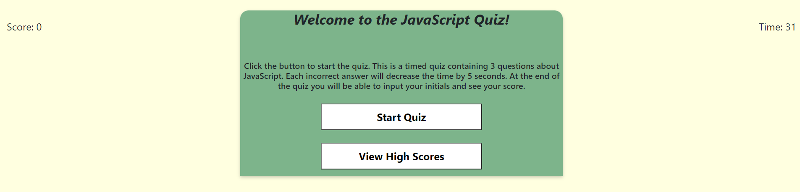

<h2>JavaScript Quiz</h2>

I have built a timed coding quiz with 3 multiple-choice questions. This app will run in the browser and will feature dynamically updated HTML and CSS powered by JavaScript code.

The user will have 31 seconds to answer 3 questions, presented in random order. If an answer is incorrect, the user will be penalized with a loss of 5 seconds per missed question. There is a start quiz button and the user will be able to view their score in an ordered list where rank is captured on screen.

The user will land on a homepage in the app. This shows the score, timer, start quiz and view high scores buttons.

 

When the user clicks start quiz they will be presented with one of 3 random questions and 4 answers. This quiz will loop through all 3 questions.

 

The user will be invited to input their initials and record the score, which will go to local storage.

 

The rank of the user and game score will be recorded and shown on the final screen. They can opt to play again with a quiz reset or clear scores.

 

 
<a href = "https://nparker80.github.io/Quiz_Game_JS/">Link to Quiz</a>
